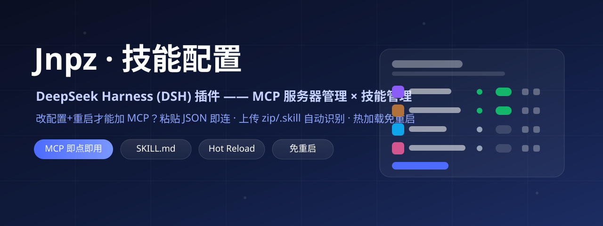
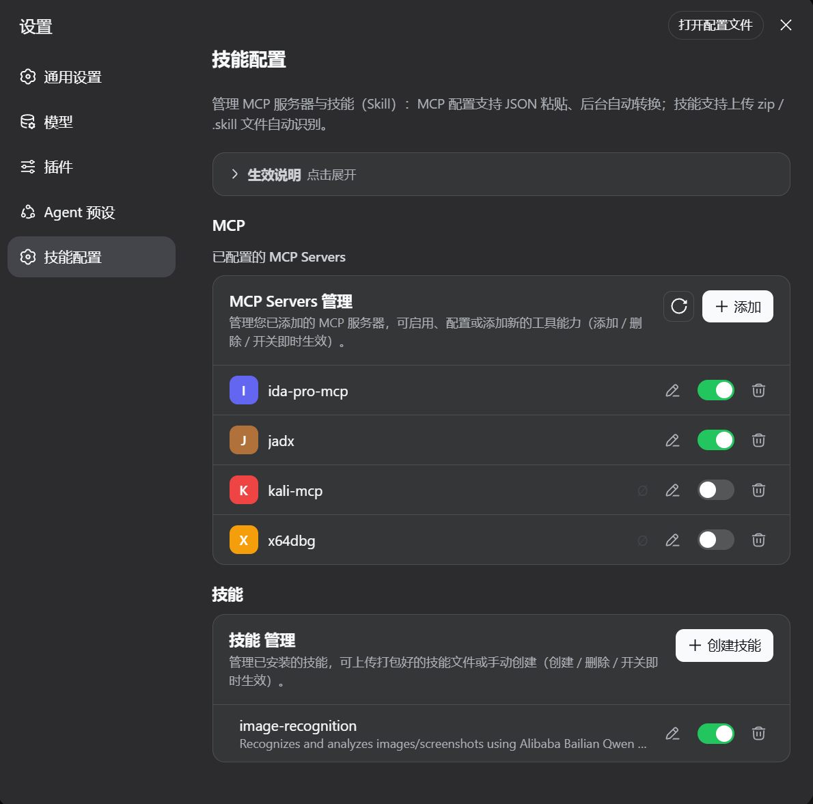
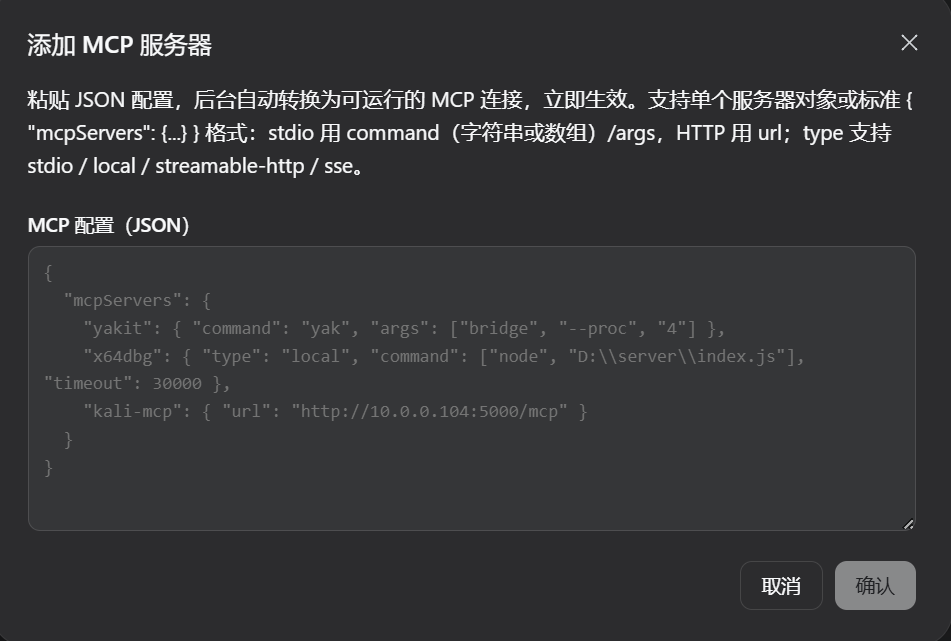
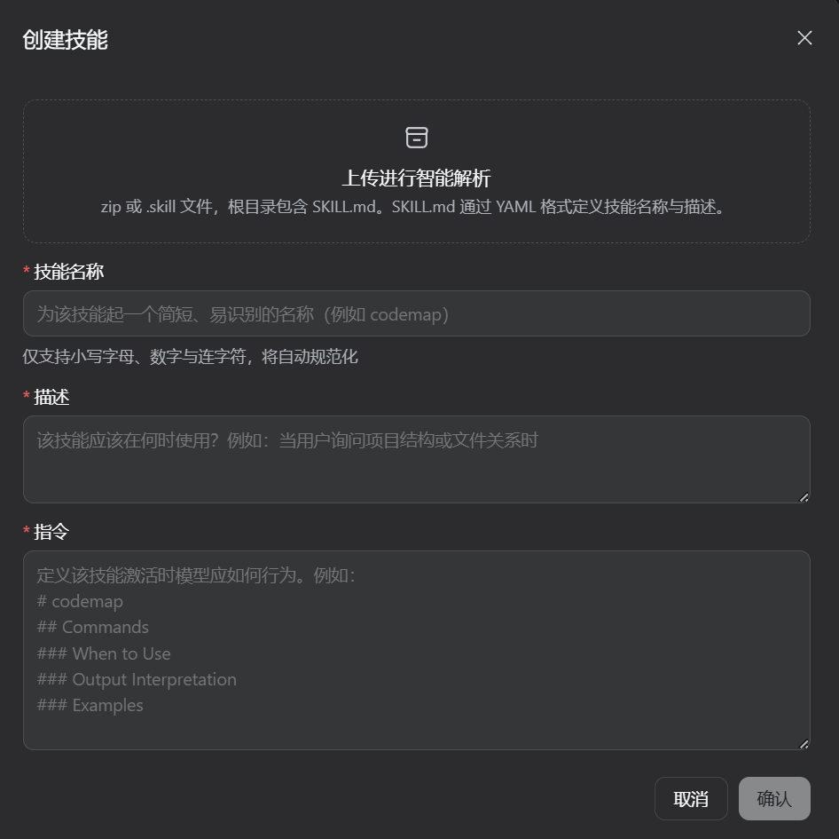

<div align="center">



<br>

# 🛠 Jnpz · 技能配置（Skills & MCP）—— DeepSeek Harness 插件

**一个 <a href="https://github.com/deepseek-ai">DeepSeek Harness (DSH)</a> 的 Web 插件：**<br/>
在设置页新增「**技能配置**」分类 —— **MCP 服务器管理**（JSON 粘贴、后台自动转换、热加载）+ **技能（Skill）管理**（zip/.skill 上传智能解析、创建、编辑、启停）。

<a href="LICENSE"></a>
<a href="https://github.com/topics/dsh-plugin"></a>
<a href="https://github.com/topics/mcp"></a>


<br>

> 🏷️ **DSH plugin · DeepSeek Harness 插件 · MCP 管理器 · MCP server manager · Skill manager · 技能管理 · AI Agent 工具 · Model Context Protocol · no-restart hot reload · 热加载**

</div>

---

## ✨ 这是什么？

**Jnpz（技能配置）** 是 DeepSeek Harness Web 界面的一个纯插件（不修改 DSH 源码）。它把 MCP（Model Context Protocol）服务器和技能（Skill）的日常管理搬进了设置页：

- 在 设置 → 左侧导航「Agent 预设」下方新增 **「技能配置」** 分类；
- **MCP 管理**：粘贴 JSON 即可添加 MCP 服务器（支持 `mcpServers` 标准格式、单个对象、`stdio`/`local`/`streamable-http`/`sse`、`command` 数组写法、`timeout`），**后台自动转换**并**立即连接**——无需重启 DSH，即加即用；
- **技能管理**：上传 `zip` / `.skill` / `.md` 自动识别 `SKILL.md` 的 YAML 元数据并回填表单，或手动创建；支持**改名、编辑指令、启停、删除**，写入 `~/.dsh/skills` 后 DSH 自动发现、即时生效。

适合所有用 DSH + MCP 工具（IDA Pro、JADX、Yakit、x64dbg、Kali、AnythingLLM……）和自定义技能做 AI Agent 工作流的开发者。

## 📸 界面预览

### 技能配置主页（MCP 管理 + 技能管理）



> 上方「生效说明」卡片可折叠；MCP 列表每行有彩色图标、连接状态（✓ 已连接 / Ø 已禁用）、编辑 ✏️、启停开关、删除 🗑。

### 添加 MCP 服务器（JSON 粘贴，后台自动转换）



> 支持标准 `{ "mcpServers": {...} }` 格式与单个服务器对象；示例覆盖 `yakit`（stdio）、`x64dbg`（local + command 数组 + timeout）、`kali-mcp`（HTTP url）。

### 创建技能（上传智能解析 + 表单）



> 拖拽/点击上传 `zip` 或 `.skill`（根目录含 `SKILL.md`），自动识别 YAML 中的技能名称与描述并回填「技能名称 / 描述 / 指令」三个必填项。

## 🎯 功能特性

| 模块 | 能力 |
| --- | --- |
| **MCP 管理** | ✅ 粘贴 JSON 一键添加（批量 `mcpServers` 或单个对象）<br/>✅ 后台自动转换：`stdio` / `local` / `streamable-http` / `sse`，`command` 支持字符串或数组，`timeout` 自动映射<br/>✅ 热加载：添加/删除/启停**即时生效，无需重启**<br/>✅ 实时连接状态（✓/Ø/⏳），断开自动重试<br/>✅ 行内编辑 ✏️（JSON 预填）、删除 🗑（自定义确认弹窗）<br/>✅ 读取 `cordis.patch.yml` 中的 MCP 并支持运行时启停 |
| **技能管理** | ✅ 上传 `zip` / `.skill` / `.md` 自动解析 `SKILL.md`（YAML frontmatter）<br/>✅ 手动创建：技能名称 / 描述 / 指令（Markdown）<br/>✅ 编辑：改名（自动规范化）、改描述、改指令<br/>✅ 启停开关（`disable-model-invocation` / `user-invocable`）<br/>✅ 删除（自定义确认弹窗）<br/>✅ 写入 `~/.dsh/skills/<name>/SKILL.md`，DSH 自动发现 |
| **体验** | ✅ 深色/浅色主题自适应<br/>✅ 中英双语界面<br/>✅ 「生效说明」可折叠提示卡<br/>✅ 全部操作走插件自有 HTTP 接口，纯插件实现、可完全卸载 |

## 🚀 快速开始

> 环境要求：DeepSeek Harness（DSH）Web profile（`~/.dsh/profiles/web`）、Node.js、pnpm。

```powershell
# 一键安装（Windows）
powershell -ExecutionPolicy Bypass -File .\install.ps1
```

脚本会：打包 → 安装到 web profile（包名 **Jnpz**）→ 注册进 `cordis.patch.yml`（DSH 热加载，**无需重启进程**）。

完成后：

1. 刷新 `http://127.0.0.1:3080`；
2. 设置 → 左侧导航 **「技能配置」**；
3. （可选）设置 → 插件 → 全部 中看到 **Jnpz**。

### 手动安装

```powershell
cd ~/.dsh/profiles/web
pnpm add -w ./Jnpz-latest.tgz        # 由 install.ps1 生成，或自行 pnpm pack
# 向 cordis.patch.yml 追加：
#   - insert:
#       - id: skill-config
#         name: 'Jnpz'
```

### 卸载

```powershell
cd ~/.dsh/profiles/web
pnpm remove -w Jnpz
# 删除 cordis.patch.yml 中 skill-config 条目；
# 状态文件 ~/.dsh/plugins/dsh-skill-config/ 可一并删除
```

## 🧩 使用说明

### MCP 配置：支持三种 JSON 写法

```jsonc
// ① 标准 mcpServers 批量格式（推荐）
{
  "mcpServers": {
    "yakit": { "command": "yak", "args": ["bridge", "--proc", "4"], "env": {} },
    "kali-mcp": { "url": "http://10.0.0.104:5000/mcp", "headers": {} }
  }
}

// ② 单个服务器对象（自动识别 stdio / HTTP）
{ "serverName": "jadx", "command": "uv", "args": ["run", "jadx_mcp_server.py"] }
{ "type": "sse", "serverName": "remote", "url": "http://host/mcp" }

// ③ local 类型 + command 数组 + timeout（x64dbg 等客户端格式）
{ "x64dbg": { "type": "local", "command": ["node", "D:\\server\\index.js"], "timeout": 30000 } }
```

- `type` 支持 `stdio` / `local` / `streamable-http` / `sse`（`transport` 键同理）；
- `command` 支持**字符串或数组**（数组首元素为可执行文件，其余自动并入参数）；
- `timeout` 自动映射为工具调用超时；
- 确认后**后台自动转换**为 `dsh-mcp-client` 实例，立即连接、状态实时可见。

### 技能（Skill）

- **上传智能解析**：`zip` / `.skill` / `.md`，根目录（或一级子目录）含 `SKILL.md`，自动读取 YAML frontmatter 的 `name` / `description` 并回填表单；
- **手动创建**：技能名称（自动规范化为小写连字符，如 `codemap`）、描述、指令（Markdown）；
- **编辑**：行内 ✏️ 打开编辑弹窗，可改名 / 改描述 / 改指令；
- **启停**：关闭后写入 `disable-model-invocation: true` + `user-invocable: false`，DSH 不再调用该技能；再次打开即恢复。

## 🛠 架构

| 文件 | 作用 |
| --- | --- |
| `lib/index.js` | Host 端：注册 `/plugins/skill-config/*` 路由；JSON → MCP 转换；`ctx.plugin()` 动态启停 MCP；技能文件读写；状态持久化 |
| `lib/core.js` | 纯逻辑：zip 解压（零依赖）、SKILL.md frontmatter 解析、MCP JSON 规范化、名称处理 |
| `lib/client.js` | 浏览器端 bundle：`settings.section`（order 30，Agent 预设之后）+ 全部界面 |

客户端与宿主端通过同源 `POST /plugins/skill-config/*`（JSON）通信；MCP 配置保存在 `~/.dsh/plugins/dsh-skill-config/state.json`，重启后自动重连。

## ❓ 常见问题

**Q：添加/删除 MCP 需要重启 DSH 吗？** 不需要。JSON 转换、启停、删除全部**热加载**，即点即生效。

**Q：技能创建后多久生效？** 立即。`dsh-skill-filesystem` 会监听 `~/.dsh/skills` 目录并自动发现。

**Q：插件管理里为什么叫 Jnpz？** npm 包名不允许中文；设置左侧导航的分类名仍为中文「技能配置」。

**Q：更新插件后怎么生效？** 重跑 `install.ps1`：仅 `lib/client.js` 改动浏览器自动热更新（刷新即可）；`lib/index.js` 改动需重启 DSH（`npx @deepseek-ai/dsh web`）。

**Q：为什么有些 MCP 行没有编辑/删除按钮？** 带 `cordis.yml` 徽标的是配置在 `cordis.patch.yml` 中的服务器：开关即时生效，永久增删请编辑该文件（保存后自动热加载）。

## 📚 Keywords / 关键词

`DeepSeek Harness` `DSH` `DSH plugin` `dsh-plugin` `MCP` `MCP server` `Model Context Protocol` `mcp-client` `AI Agent` `AI tools` `LLM tools` `skill` `skills` `skill manager` `SKILL.md` `agent preset` `智能体` `技能配置` `技能管理` `热加载` `hot reload` `无重启` `插件` `IDA Pro` `JADX` `Yakit` `x64dbg` `Claude Code` `cursor` `chef` `antigravity`

## 📄 License

[MIT](LICENSE) © Jnpz contributors

---

<details>
<summary>🇬🇧 English</summary>

**Jnpz — Skills & MCP configuration plugin for DeepSeek Harness (DSH).**

Adds a new **“技能配置 / Skills & MCP”** section to the DSH web settings (right below Agent Presets):

- **MCP manager** — paste JSON (`mcpServers` or a single server object), it is converted host-side into live `dsh-mcp-client` instances. Supports `stdio` / `local` / `streamable-http` / `sse`, string or array `command`, `timeout`. Add / remove / toggle take effect **immediately, no restart**.
- **Skill manager** — upload `zip` / `.skill` / `.md` and the `SKILL.md` YAML frontmatter is parsed automatically to prefill the create form; create, rename, edit instructions, toggle and delete skills stored under `~/.dsh/skills`.

Install (Windows):

```powershell
powershell -ExecutionPolicy Bypass -File .\install.ps1
```

Then refresh `http://127.0.0.1:3080` → Settings → **技能配置**. The plugin shows up as **Jnpz** under Settings → Plugins.
</details>
